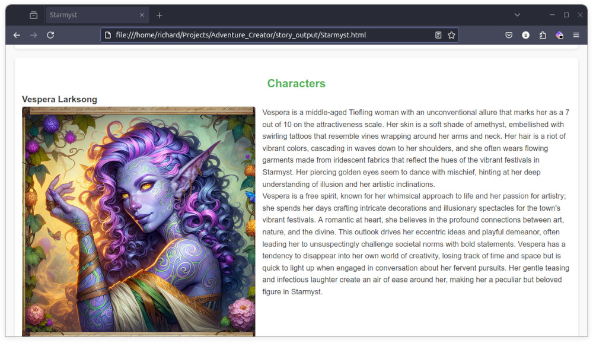
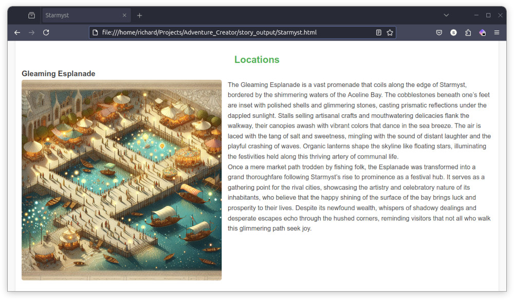
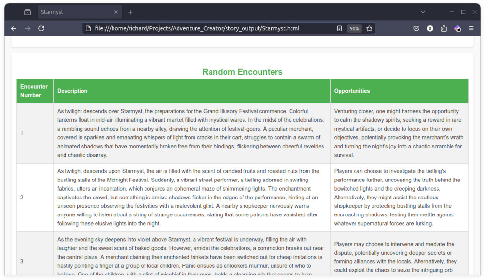

# AI Adventure Creator

Welcome to AI Adventure Creator! This project is a learning project for me (so some of the code is sketchy at best). The idea is to created scripted interactions with remote Large Language Models (LLM) that take a simple map image and create ttrpg world resources. Utilizing a multi-threaded approach, this tool spends your money to bring your campaign ideas to life through the use of LLM and AI image generation.

## Features

- **Multi-threaded AI Processing**: Generates detailed campaign settings by dividing tasks among multiple threads (but throttled in some cases because of ratelimits)
- **LLM Integration**: Leverages large language models to create narrative elements: Currently, OpenAI and Ollama
- **AI Image Generation**: Uses state-of-the-art generative models to craft custom visuals for your campaign. (This feature is currently limited to DALLE)

## Important Notes

### Work in Progress

Please note that this project is in active development. As such, many features are not fully functional or have known issues, including but not limited to:

- **Ollama Code**: Needs fixes. 
    - Initial map reading is only done with gpt-4o. The llava:13b model does not appear to work well for maps. I am hoping Pixtral will be able to do the job.
    - llama3.1 seems eager to break rules about structured outputs.
- **API Call Estimator**: Very crude and requires improvement. This will probably get dropped because ...
- **Prompt Management**: Prompts often spiral out of control. There are lenth and structure checks, but those cost additional api calls.
- **Docker container build**: I indend to provide a Dockerfile and make a completed Docker or Podman container available.

## Sample Images

Review the `sample_inputs/` contents.You can customize world lore and visual / writing style in these files.
Provide a map image and automatically generate (when it works) a random number of:

### Characters



### Locations



### Encounters



## Prerequisites

- An OpenAI API key, which should be stored in an environment variable named `OPENAI_API_KEY`.

## Installation & Running

1. **Clone the repository**:
    ```bash
    git clone https://github.com/yourusername/ai-adventure-creator.git
    cd ai-adventure-creator
    ```

2. **Add your OpenAI API key**:
    ```bash
    export OPENAI_API_KEY=your_openai_api_key_here
    ```

3. **Install requirements and run the project**:
    `run.sh` is a simple bash script that will run `pip -r requirements.txt` before running the start script.
    ```bash
    $ .venv/bin/activate
    (.venv)$ ./run.sh
    ```

    `run.sh` runs this command:
    ```bash
    (.venv)$ python -m adventure_generation.main \
    ./sample_inputs/ariel_coast.txt \
    ./sample_inputs/ariel_coast.jpg \
    ./sample_inputs/styles.json
    ```

## Docker container usage
```bash
$ docker run --rm \
-e OPENAI_API_KEY=$OPENAI_API_KEY \
-v ./sample_inputs/:/app/input/ \
-v ./output/:/app/output/ \
mrrichard/adventure_creator:1.0 \
/app/input/ariel_coast.txt /app/input/ariel_coast.jpg /app/input/styles.json
```

## Control Function with Environmental Variables
| Variable                | Description                                                              | Options                                                                                 |
|------------------------|--------------------------------------------------------------------------|----------------------------------------------------------------------------------------|
| `OPENAI_API_KEY`       | Your OpenAI API key.                                                    | Your OpenAI API key.                                                                  |
| `AC_USE_MONEY`         | Set to 'True' to use paid OpenAI models or 'False' for free local runs. | `True` or `False` (default is `True`).                                               |
| `AC_CREATE_IMAGES`     | Controls whether to generate images.                                    | `True` or `False` (default is `True`).                                              |
| `AC_DEBUG`             | Enable debug mode to simplify task and check the flow.                 | `True` or `False` (default is `False`).                                             |
| `AC_OLLAMA_SERVER`     | IP address of the Ollama server instance to connect to.                | Valid IP address or localhost (default is `localhost`*).                |
| `AC_AUTO1111_SERVER`   | IP address of the AUTOMATIC1111 server instance to connect to.         | Valid IP address or localhost (default is `localhost`*).


\* HTTP only. HTTPS will require changing code. Default port numbers will be applied:
- Ollama port 111434
- AUTO1111: 7860

## Have Fun
I know the internet is being pumped full of AI trash. This project does its best to allow you to create novel combinations and use your creativity to create a base framework to play with. Have fun. Be aware that if used correctly, this will spend a few GPT bucks. 
