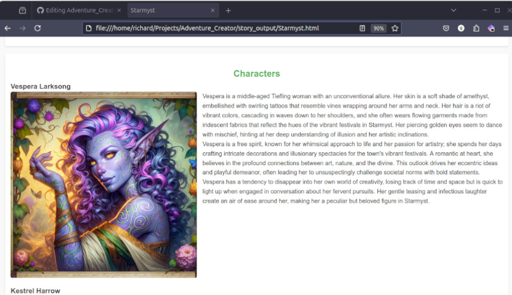

# AI Adventure Creator

Welcome to AI Adventure Creator! This project is a learning project for scripted interactions with remote Large Language Models (LLM). Utilizing a multi-threaded approach, this tool spends your money to bring your campaign ideas to life through the use of LLM and AI image generation.

## Features

- **Multi-threaded AI Processing**: Generates detailed campaign settings by dividing tasks among multiple threads (but throttled because ratelimits)
- **LLM Integration**: Leverages large language models to create narrative elements.
- **AI Image Generation**: Uses state-of-the-art generative models to craft custom visuals for your campaign.

## Important Notes

### Work in Progress

Please note that this project is in active development. As such, many features are not fully functional or have known issues, including but not limited to:

- **Ollama Code**: Needs updates.
- **Image Parsing Alternatives**: Current use of GPT-4o is insufficient; investigating better alternatives as Llava doesn't meet needs.
- **API Call Estimator**: Very crude and requires improvement.
- **Prompt Management**: Prompts often spiral out of control.
- **DALL-E Text Issues**: DALL-E frequently includes unwanted text in images.

## Sample Images

Provide a map image and automatically generate a random number of:

### Characters



### Locations


### Encounters


## Prerequisites

- An OpenAI API key, which should be stored in an environment variable named `OPENAI_API_KEY`.

## Installation & Running

1. **Clone the repository**:
    ```bash
    git clone https://github.com/yourusername/ai-adventure-creator.git
    cd ai-adventure-creator
    ```

2. **Add your OpenAI API key**:
    ```bash
    export OPENAI_API_KEY=your_openai_api_key_here
    ```

3. **Install requirements and run the project**:
    ```bash
    ./run.sh
    ```

## Have Fun
I know the internet is being pumped full of AI trash. This project does its best to allow you to create novel combinations and use your creativity to create a base framework to play with. Have fun. Be aware that if used correctly, this will spend a few GPT bucks. 
